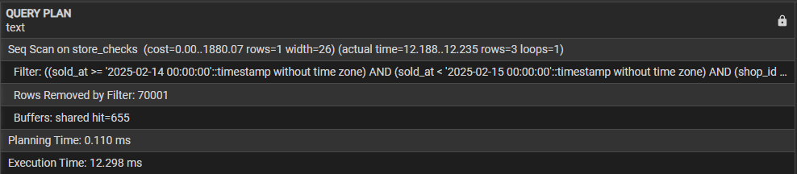
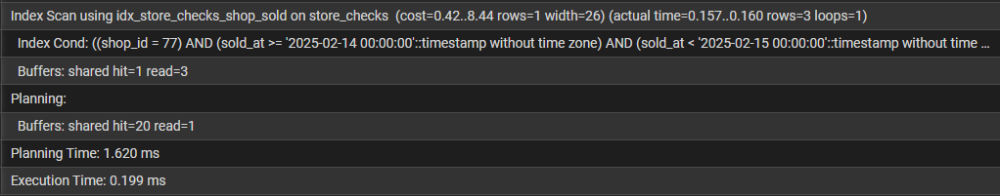
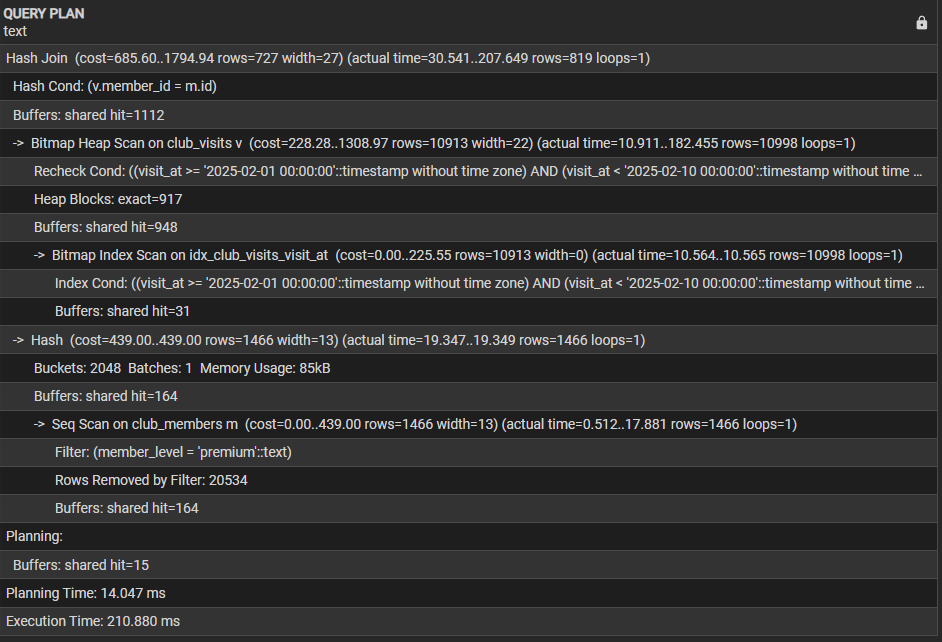
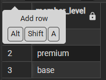
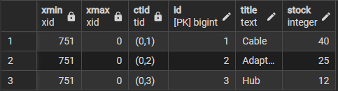
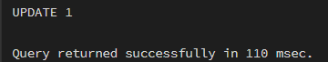
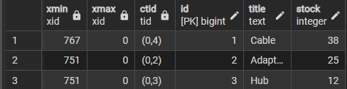
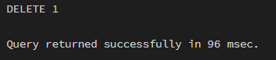
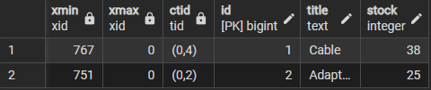

# КОНТРОЛЬНАЯ РАБОТА


## 1. Оптимизация простого запроса

```
EXPLAIN (ANALYZE, BUFFERS)
SELECT id, shop_id, total_sum, sold_at
FROM store_checks
WHERE shop_id = 77
  AND sold_at >= TIMESTAMP '2025-02-14 00:00:00'
  AND sold_at < TIMESTAMP '2025-02-15 00:00:00';
```

Результат ДО создания индекса:



Создание индекса:

```
CREATE INDEX idx_store_checks_shop_sold ON store_checks (shop_id, sold_at);
```

Результат ПОСЛЕ индекса:



Объяснение:
1. Изначально использовался Seq Scan - бежал проверять ВСЕ строки - медленно
2.  
```
CREATE INDEX idx_store_checks_payment_type ON store_checks (payment_type);
CREATE INDEX idx_store_checks_total_sum_hash ON store_checks USING hash (total_sum);
```
Эти индексы не помогли, т.к. payment_type и total_sum не участвуют в запросе
3. Добавление индекса ускорило выполнение запроса, т.к. под условие конкретного айди попадает маленькое количество строк -> просто бегаем по длине дерева, что быстрее
4. Я думаю, что конкретно для этого запроса выполнять ANALYZE необходимо, потому что если собираемся добавлять 1000000000000000 записей c shop_id - тогда index scan станет очень медленным
## 2. Анализ и улучшение JOIN-запроса
Запрос: 

```
EXPLAIN (ANALYZE, BUFFERS)
SELECT m.id, m.member_level, v.spend, v.visit_at
FROM club_members m
JOIN club_visits v ON v.member_id = m.id
WHERE m.member_level = 'premium'
  AND v.visit_at >= TIMESTAMP '2025-02-01 00:00:00'
  AND v.visit_at < TIMESTAMP '2025-02-10 00:00:00';
```

1. Результат ДО создания индекса:


2. Использовался hash join
3. Думаю, планировщик использовал хэш, т.к. у нас всегоо 3 типа member_level:

```
select distinct member_level from club_members;
```


ему проще посчитать хэш для каждой записи и просто сравнить его
4. Из тех, что были написаны за меня(вами):

```
CREATE INDEX idx_club_visits_visit_at ON club_visits (visit_at);
CREATE INDEX idx_club_members_full_name ON club_members (full_name);
```

индекс на полное имя бесполезен - оно не участвует в запросе
индекс на visit_at норм, но лучше gist, а не обычный
5. Я бы поменял первый индекс на GIST:

до - 210мс

код: 
```

```
после - 
## 3. MVCC и очистка
Выполняю код:

```

SELECT xmin, xmax, ctid, id, title, stock
FROM warehouse_items
ORDER BY id;

```


```

UPDATE warehouse_items
SET stock = stock - 2
WHERE id = 1;

```



```

SELECT xmin, xmax, ctid, id, title, stock
FROM warehouse_items
ORDER BY id;

```



```

DELETE FROM warehouse_items
WHERE id = 3;

```




```

SELECT xmin, xmax, ctid, id, title, stock
FROM warehouse_items
ORDER BY id;

```


1. Мы видим, что CTID поменялось - все дело в том, как устроен UPDATE(см. пункт 2)
Т.к. строки новые, у них новый xmin. По той же причине(т.к. они новые) у них нет никакого перезатирания в xmax(xmax = 0), хоть и кажется, что xmax должен иметь значение новых xmin

2. Дело в том, что UPDATE по сути своей является комбинацией DELETE + INSERT

3. После DELETE строка пометилась как грязная, а т.к. к ней больше никто не обращался, она удалилась из журнала

5. Полная блокировка может произойти с VACUUM FULL

## 4. Блокировки строк  

## 5. Секционирование и partition pruning
