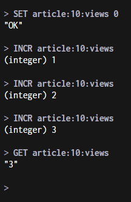
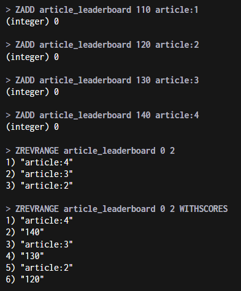
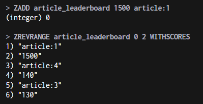
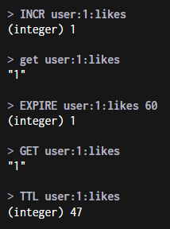

# Homework: Redis / Valkey

---

# Часть 1. Запуск Redis

1. Запуск Redis через Docker:

```

docker run -d --name redis -p 6379:6379 redis

```


2. Подключитесь к Redis CLI.

Чтобы использовать Redis CLI, я запустил Redis CLI, на котором есть отдельное окно CLI:

```

docker run -d --name redisinsight -p 5540:5540 redis/redisinsight

```

---

# Часть 2. Счётчик просмотров

Создание, обновление, получение счетчика:

```

SET article:10:views 0;

INCR article:10:views;
INCR article:10:views;
INCR article:10:views;

GET article:10:views;

```



---

# Часть 3. Рейтинг статей

Создание и заполнение списка 

```

ZADD article_leaderboard 100 article:1
ZADD article_leaderboard 110 article:2
ZADD article_leaderboard 120 article:3
ZADD article_leaderboard 130 article:4

```

Получаем ТОП-3 без баллов

```

ZREVRANGE article_leaderboard 0 2

```

Получаем ТОП-3 с баллами:

```

ZREVRANGE article_leaderboard 0 2 WITHSCORES

```



Меняем значение article:1 и смотрим новый топ:

```

ZADD 1500 article:1

ZREVRANGE article_leaderboard 0 2 WITHSCORES

```

Результат:



---

# Часть 4. Ограничение действий пользователя
Создаем лайки юзера со значением 1, вешаем ограничение в 60сек
```
+
INCR user:1:likes

EXPIRE user:1:likes 60

```

Смотрим результат: 

```

GET user:1:likes
TTL user:1:likes

```


